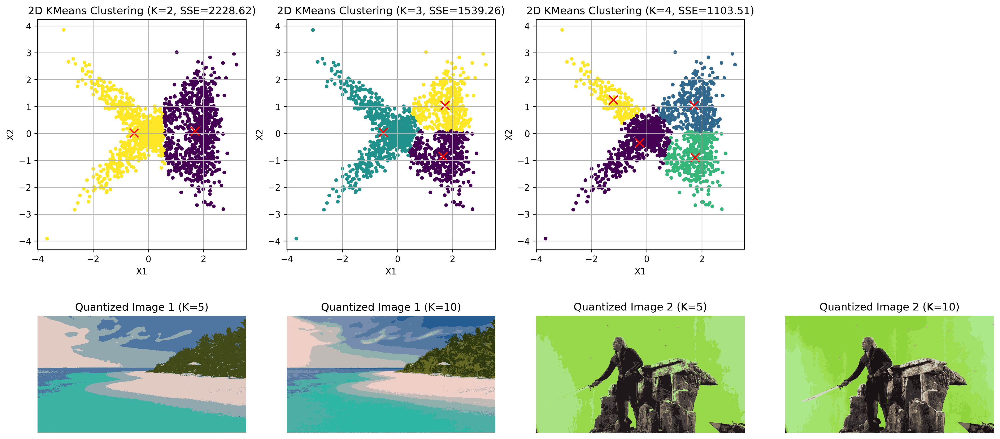

# Part 2 Write-Up
write-up include the visualizations of the execution of K-means for K=2, 3, and 4 on the
Gaussian data; for part 2(ii), include a visualization of your K-means clustering in the color space of each image
for K=5 and K=10.

