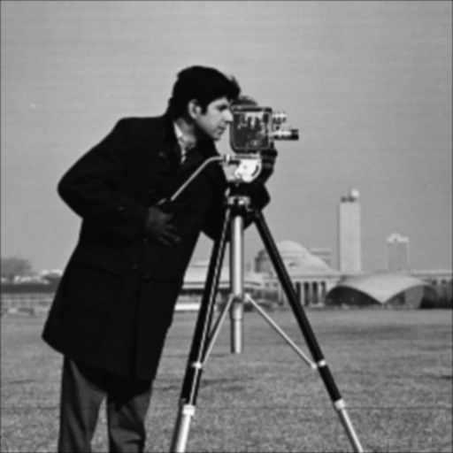
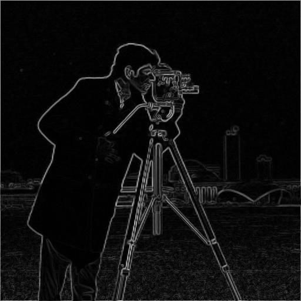
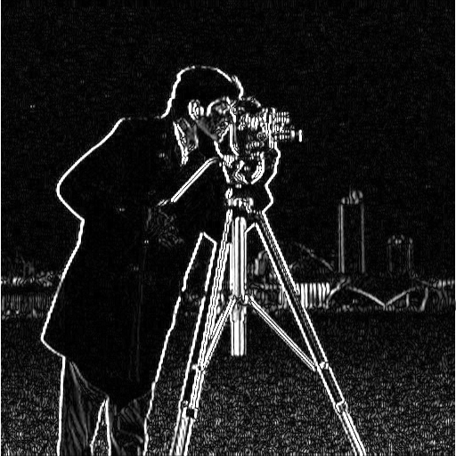
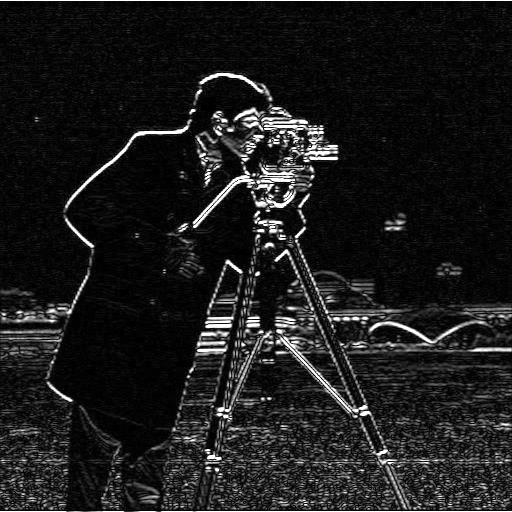
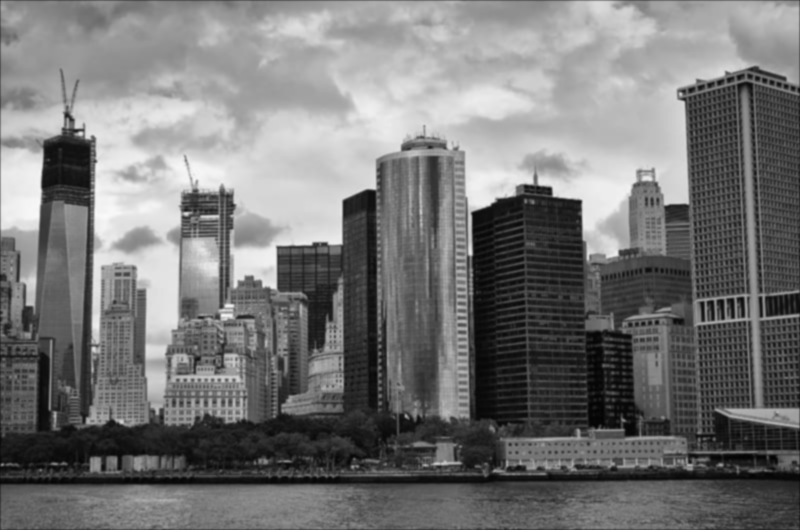
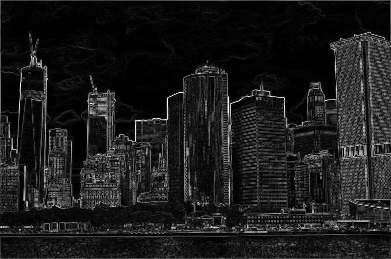
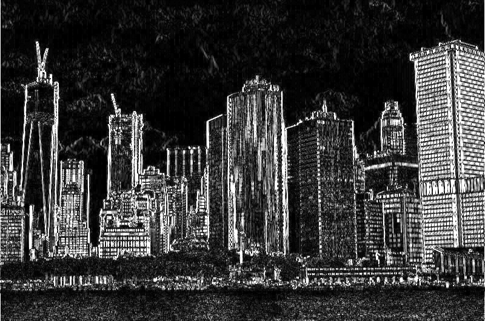

# How to run
```sh
$ make
$ ./part_one 1   # loads filter1_img.jpg
$ ./part_one 2   # loads filter2_img.jpg
```
# BEFORE IMAGES


# AFTER IMAGES

## Filter1 Image Results
### 3x3 Gaussian Filter


### 5x5 Gaussian Filter


### Sobel Detection


### Difference of Gaussians (DoG)


### GX and GY Images



## Filter2 Image Results
### 3x3 Gaussian Filter


### 5x5 Gaussian Filter


### Sobel Detection


### Difference of Gaussians (DoG)


### GX and GY Images

<img src="output/gy_image2.png" alt="Filter2 GY" width