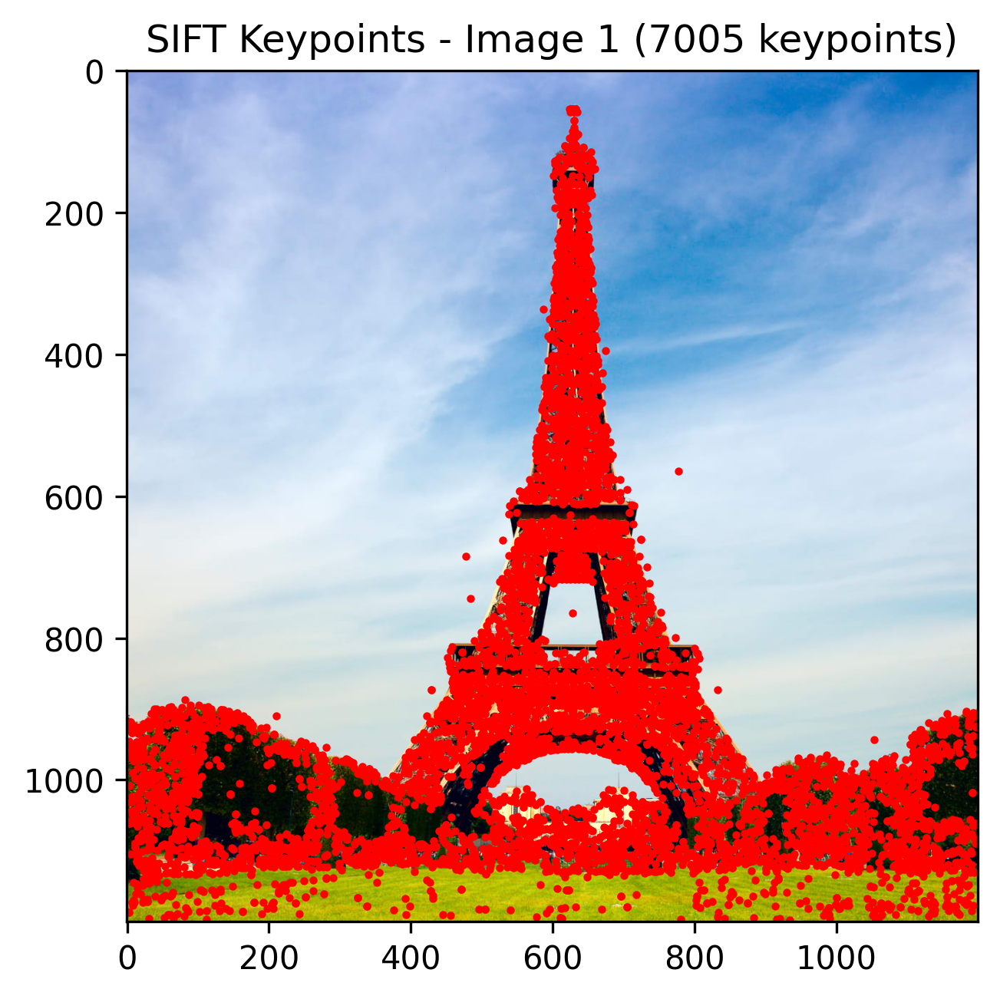
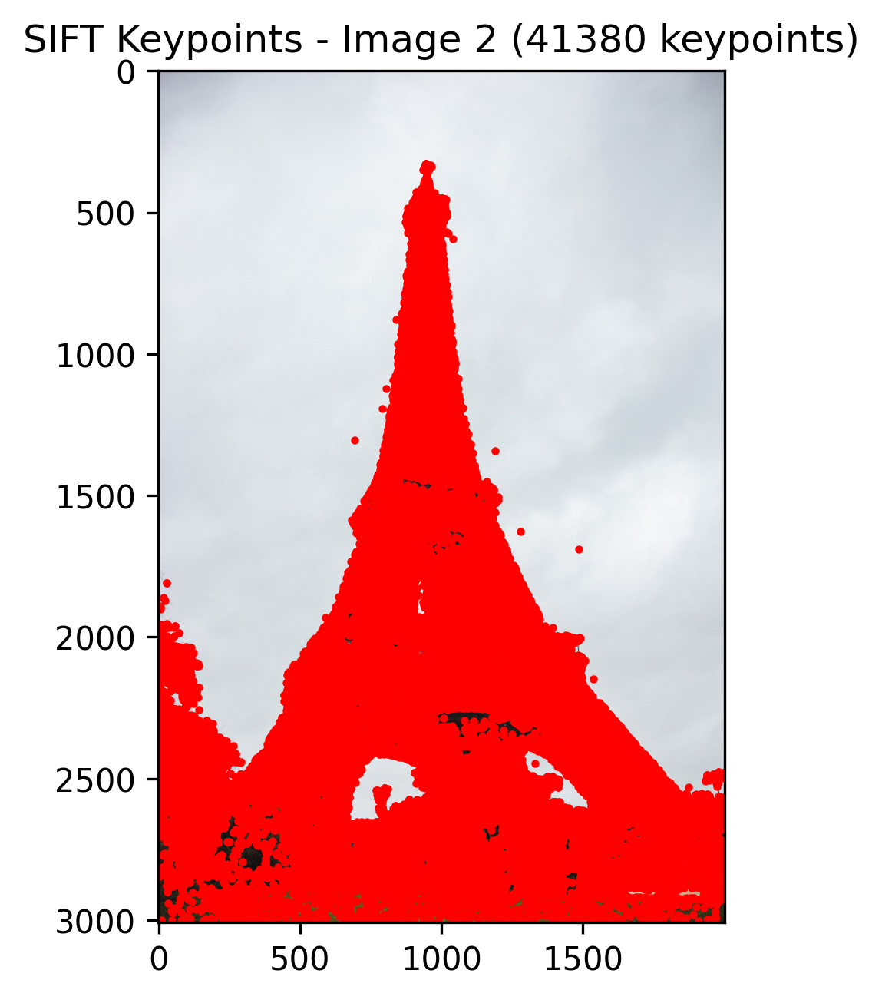
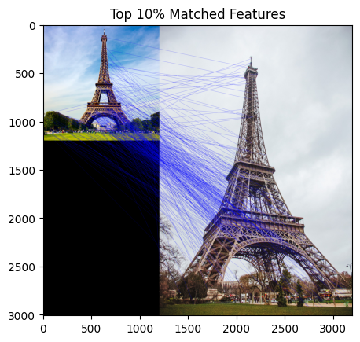

# Part 3 Write-Up
write-up include visualizations of all of the SIFT keypoints detected for the test images.
After pruning the bottom 90% of matches, include a visualization of the top 10% of keypoint matches that
correlates each of the remaining keypoints in image 1 with its corresponding keypoint in image 2 (this
visualization can be done through a common color scheme so that matching keypoints have the same color, or
by drawing lines between matching keypoints as shown below).

### Matching Keypoints Visualization

